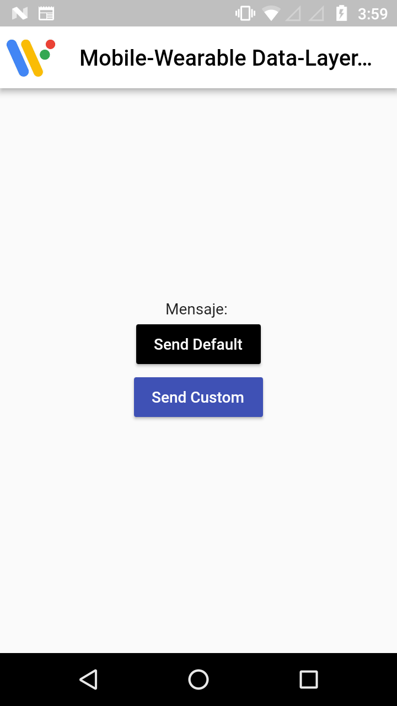
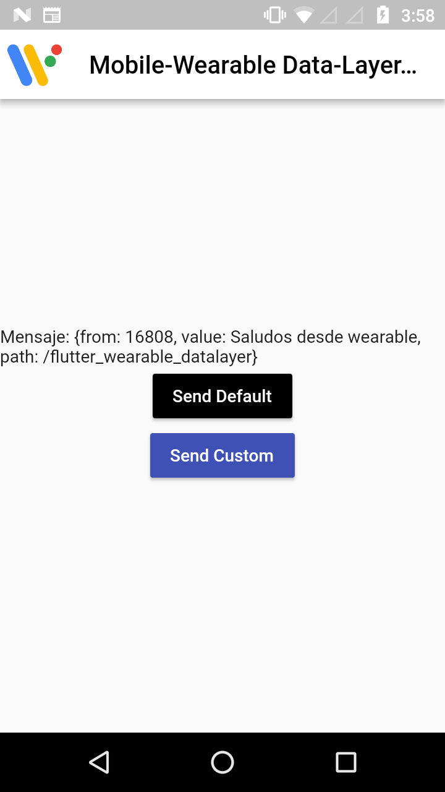
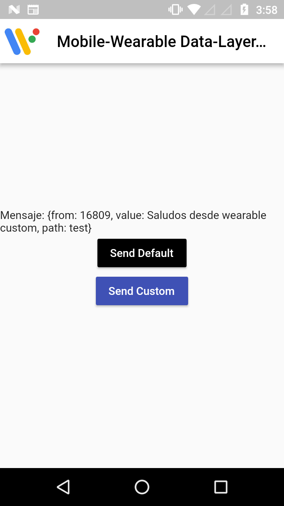
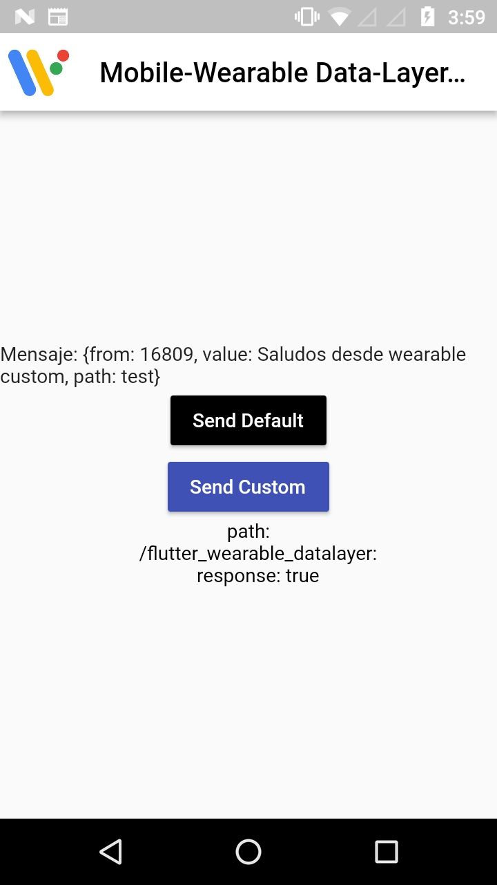

# mobile_wearable_data_layer (Android Only)

A Flutter plugin to send and receive messages on mobile to **wearOS** ([Data-Layer](https://developer.android.com/training/wearables/data-layer/messages.html)).

Note: This plugin is still under development.

<div style="display:flex;flex-direction:row;">
    
    
    
    
</div>

### Sync Wearable with device

Read information [here!](https://developer.android.com/training/wearables/apps/creating?hl=es-419#SetupEmulator)

Once that you sync wearable with device/emulator run `adb -d forward tcp:5601 tcp:5601`

### To use
#### Android

In the file `android/setting.gradle` define wearos application path

```gradle
    include ':app', ':wearable'
    project(":wearable").projectDir = new File("../path_to_wearable_folder/android/app")
```

In the file `android/app/build.gradle` on dependencies block, add the follow code:

```gradle
    // wearable libraries
    implementation 'com.google.android.gms:play-services-wearable:15.0.1'
    // wearApp project is the same name defined previously
    wearApp project(':wearable')
```

##### Android app to mobile devices and Android app to wearable should have the same `applicationId`.

### Wearable app

Watch the project [here](https://github.com/devdennysegura/flutter_wearable_data_layer)

Thanks
------

**Denny Segura** © 2019+, Released under the [MIT License].<br>

> GitHub [@devdennysegura](https://github.com/devdennysegura) &nbsp;&middot;&nbsp;
> Twitter [@dennysegura3](https://twitter.com/dennysegura3)

[MIT License]: http://mit-license.org/
